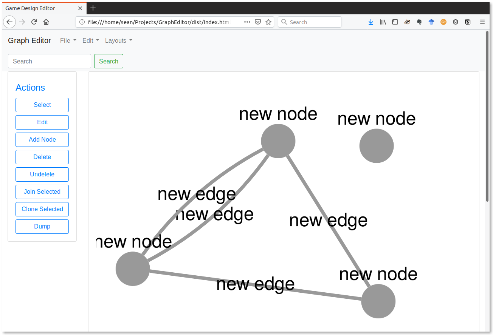

# Graph Editor

__A Node-Edge Graph Editor in a webpage__

## Status

__v 0.1__

- Currently very basic and very incomplete.
- Rudimentary graph editing in place.
- Select from various included layouts.

## Dependancies

 - bootstrap
 - cytoscape
 - graphology
 - jquery
 - popper.js
 - save-file
 - uuid
 - webpack
