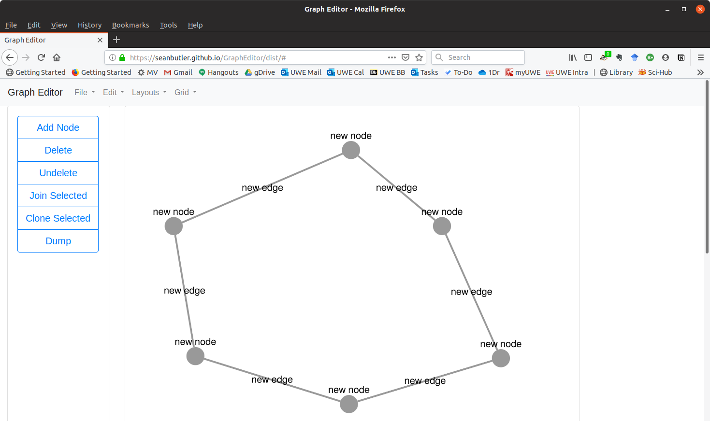

# Graph Editor

__A Node-Edge Graph Editor in a webpage__

A generic graph editor.
Made with cytoscape.js and other well known web technologies.

Permissive licence to use.

## Status

__V 0.2__

 - [ ] select node and edit data as json text
 - [ ] select arc and edit data as json text
 - [ ] save graph as local document
 - [ ] load graph from local fs document

__V 0.1__

 - [x] Normal Bootstrap User Interface.
 - [x] Rudimentary graph editing in place.
 - [x] Select from various included layouts.

## Dependancies

 - bootstrap
 - cytoscape
 - graphology
 - jquery
 - popper.js
 - save-file
 - uuid
 - webpack
